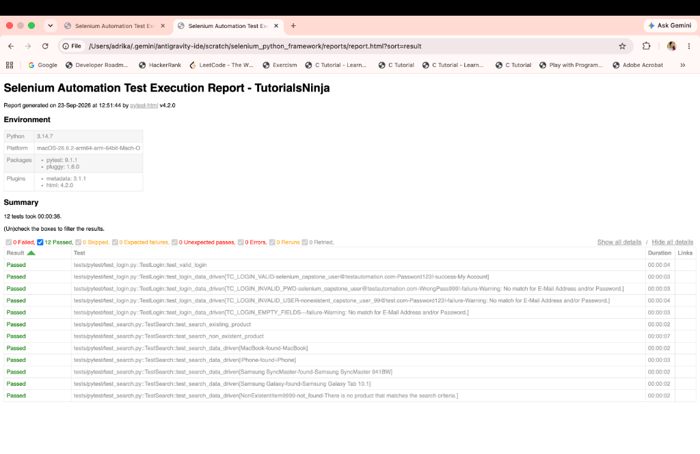
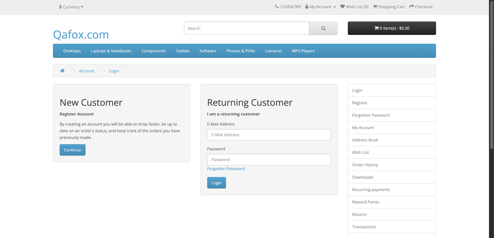
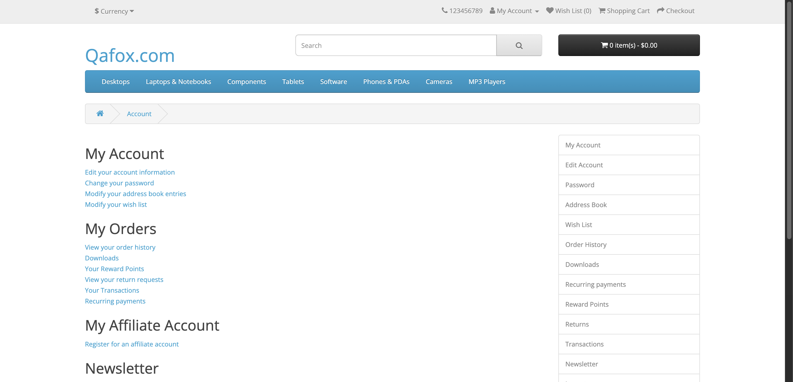
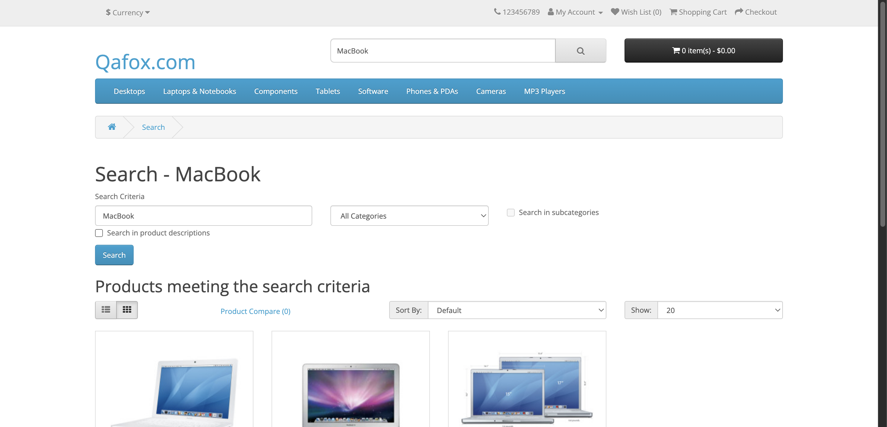
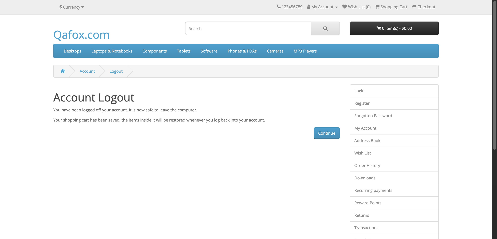
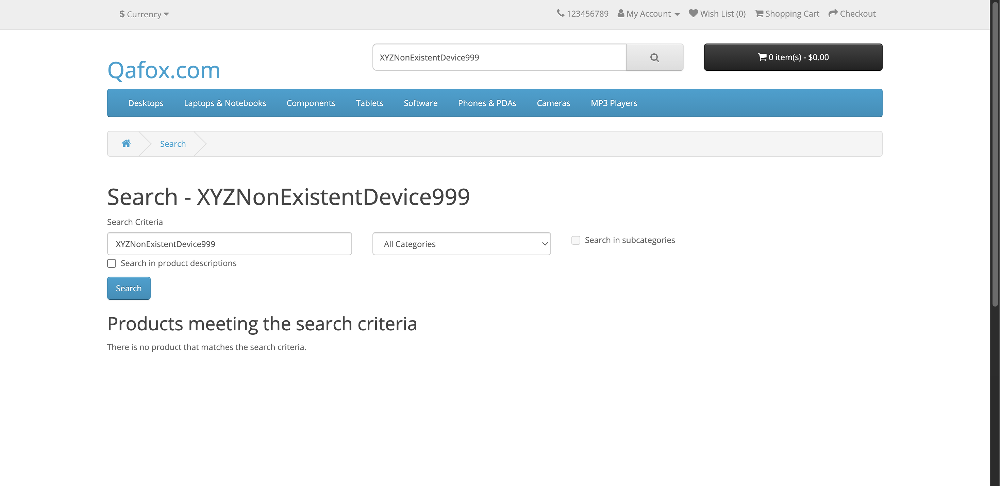

# Test Automation Outcome Screenshots

This directory contains the visual execution outcomes and HTML test report screenshots for the **Selenium Python E-Commerce Automation Framework (Capstone 2)**.

---

## 1. PyTest HTML Execution Report Overview
Displays the test report showing all test cases passed with 0 failures, duration, and execution metadata.

---

## 2. Step 1: Login Page Navigation
User navigates to the Returning Customer login page (`index.php?route=account/login`).

---

## 3. Step 2: Login Verified (My Account Dashboard)
User logs in with valid credentials, verifying arrival on the authenticated My Account dashboard.

---

## 4. Step 3: Product Search ("MacBook") Verified
Product search query `MacBook` executed from the header, returning matching product results.

---

## 5. Step 4: Account Logout Verified
User clicks Logout, asserting the Account Logout confirmation header and message.

---

## 6. Negative Test: No Product Found Message Verified
Searching for a non-existent item correctly displays `"There is no product that matches the search criteria."`

